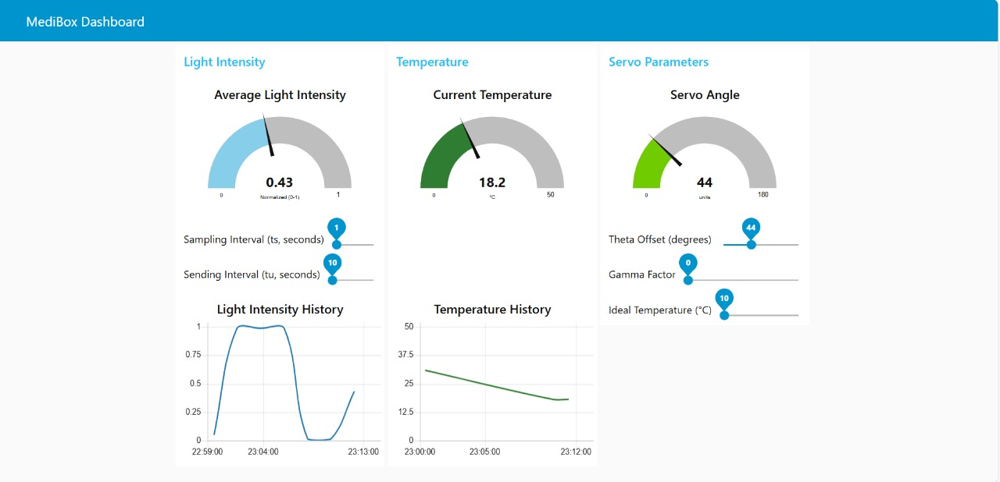

# 💊 Medibox - Smart Medicine Dispenser Simulation

**Medibox** is a smart medicine dispensing system built and simulated using the Wokwi platform. It monitors environmental conditions and medicine availability, automates a servo-controlled shade, and publishes data to a **Node-RED dashboard** via the **HiveMQ MQTT broker**.

> 📦 **Status**: Simulated version using Wokwi and integrated with Node-RED via HiveMQ MQTT broker.

---

## 🌟 Features

* 🌡️ **Temperature & Humidity Monitoring** via DHT11
* 💡 **Light Intensity Detection** using LDR
* 🚪 **Automated Servo-Controlled Shade** to protect medicine
* 📤 **MQTT Data Publishing** via HiveMQ
* 📊 **Interactive Node-RED Dashboard** for real-time monitoring
* 🔔 **Alerts** on abnormal temperature, humidity, or light
* 🧪 Fully simulated using **Wokwi Simulator**

---

## 🧠 Functional Overview

### 🖥️ Node-RED Dashboard

* Real-time **Temperature**, **Light Intensity**, and **Servo Parameters** display
* Color-coded status indicators (Normal / Warning / Critical)
* Auto-refreshing dashboard via MQTT

| User Interface |
|----------------|
|  |

---

## 🔧 Technologies Used

* **Wokwi Simulator**
* **ESP32**
* **DHT22** Sensor
* **LDR (Light Dependent Resistor)**
* **Servo Motor**
* **HiveMQ MQTT Broker**
* **Node-RED**

---

## 🚀 Getting Started

### 1️⃣ Run Simulation on Wokwi

* Open the *https://wokwi.com/*
* Download the `Wokwi Project` in Phase 2 and upload there.

### 2️⃣ Set Up Node-RED

* Install Node-RED
* Import the provided flow from `Node Red Flow.json` in Phase 2.
* Deploy to go to the dahboard.
  
---

